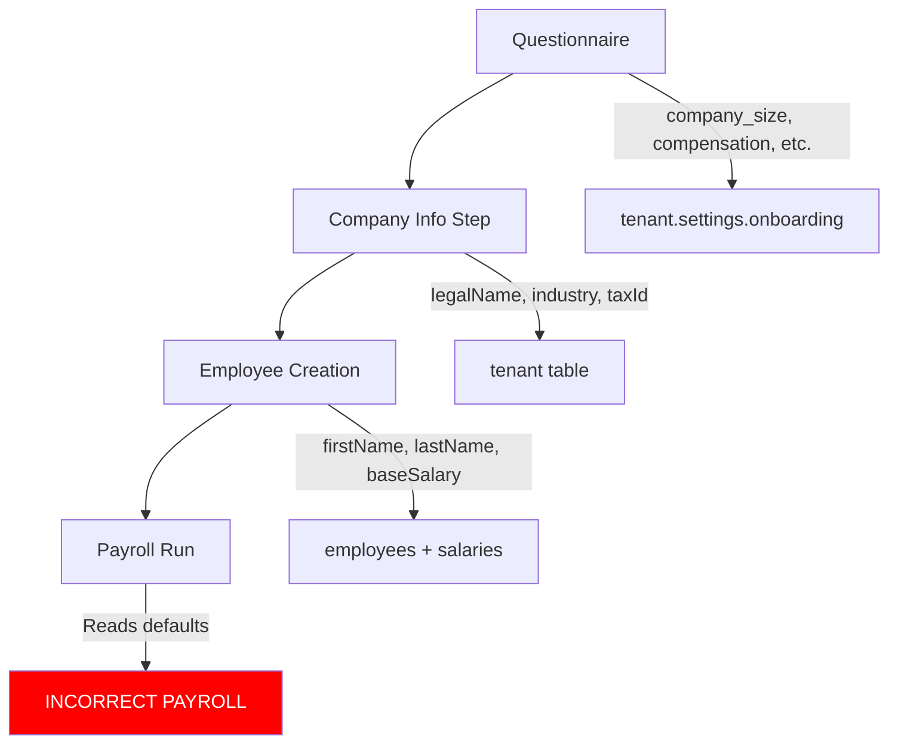

# Onboarding Payroll Correctness Audit

**Date**: 2025-10-08
**Severity**: 🔴 CRITICAL
**Status**: DATA GAPS IDENTIFIED

## Executive Summary

The current onboarding flow has **critical gaps** that result in **incomplete payroll configuration**. Employees created during onboarding will have **incorrect deductions** when payroll is run because essential data is not collected.

### Critical Impact

- ❌ **Tax calculations will be WRONG** (defaults to single person with no dependents)
- ❌ **CMU employer contributions will be WRONG** (defaults to no family = 500 FCFA instead of 5,000 FCFA)
- ⚠️ **Work accident rates may be WRONG** (defaults to SERVICES = 2%, but could be CONSTRUCTION = 5%)
- ⚠️ **Allowances not configured** (no housing/transport/meal allowances)

---

## Questions & Answers

### 1. How are payroll components/deductions decided?

Payroll deductions are calculated by `calculatePayrollV2()` which requires these inputs:

| Parameter | Purpose | Impact on Payroll | Current Source |
|-----------|---------|------------------|----------------|
| **countryCode** | Determines tax/social security rules | ✅ CORRECT - Tenant country | `tenant.countryCode` |
| **sectorCode** | Work accident contribution rate (2-5%) | ⚠️ DEFAULTS to 'SERVICES' (2%) | `tenant.sectorCode` (set during tenant creation) |
| **fiscalParts** | Tax deductions based on family status | ❌ DEFAULTS to 1.0 (single, no dependents) | `employee.customFields.fiscalParts` |
| **hasFamily** | CMU employer contribution (500 vs 5,000 FCFA) | ❌ DEFAULTS to false (500 FCFA) | `employee.customFields.hasFamily` |
| **baseSalary** | Base for all calculations | ✅ CORRECT - Collected in onboarding | `employee_salaries.baseSalary` |
| **allowances** | Housing, transport, meal allowances | ❌ DEFAULTS to 0 (no allowances) | `employee_salaries.*Allowance` |
| **taxDependents** | Number of dependents for tax calc | ❌ DEFAULTS to 0 | `employees.taxDependents` |

**Source Code References:**
- Calculation logic: `/features/payroll/services/payroll-calculation-v2.ts:64-216`
- Payroll run orchestration: `/features/payroll/services/run-calculation.ts:217-243`

```typescript
// How fiscalParts and hasFamily are read during payroll run (line 217-219)
const hasFamily = (employee.customFields as any)?.hasFamily || false;
const fiscalParts = (employee.customFields as any)?.fiscalParts || 1.0;
```

---

### 2. Does the workflow ask the right questions?

**Current Questions Asked:**

| Question | Affects Payroll? | Missing Data |
|----------|-----------------|--------------|
| Company size | ❌ No | N/A |
| Has departments | ❌ No | N/A |
| Contract types | ❌ No | N/A |
| **Compensation** | ⚠️ Indirectly | Doesn't actually configure allowances |
| Time tracking | ❌ No | N/A |
| Time off | ❌ No | N/A |
| Payroll frequency | ✅ Yes | None (correctly stored) |

**Questions NOT Asked (but CRITICAL for payroll):**

1. ❌ **Family Status** (for each employee)
   - "Est-il marié(e) ?" → affects `hasFamily` (CMU employer: 500 vs 5,000 FCFA)
   - "Combien d'enfants à charge ?" → affects `taxDependents` and `fiscalParts`

2. ❌ **Allowances** (for each employee)
   - "A-t-il une prime de logement ?" → `housingAllowance`
   - "A-t-il une prime de transport ?" → `transportAllowance`
   - "A-t-il une prime de panier ?" → `mealAllowance`

3. ⚠️ **Company Sector** (for tenant)
   - Currently set to 'SERVICES' by default
   - Should ask: "Quel est votre secteur d'activité ?"
   - Options: SERVICES (2%), COMMERCE (2%), TRANSPORT (3%), INDUSTRIE (4%), CONSTRUCTION (5%)

**Source Code:**
- Questions defined in: `/app/onboarding/questionnaire/page.tsx:26-202`
- Employee form in: `/features/onboarding/components/steps/employees-wizard-step.tsx:16-24`

---

### 3. Can users skip steps and complete later?

**Current Behavior:**

✅ **Steps cannot be skipped** during onboarding flow:
- Questionnaire must be completed (7 questions)
- Each wizard step must be completed to proceed
- "Continuer" button only appears after minimum requirements met

❌ **BUT: Missing data is set to defaults**, which means:
- Employees are created with incomplete payroll data
- No warning shown that payroll will be incorrect
- User thinks onboarding is "complete" but payroll will fail validation

**Critical Issue:**
The onboarding **feels complete** to the user, but produces **invalid payroll configuration**. This violates the HCI principle: "Make it impossible to make mistakes."

**Source Code:**
- Step validation: `/app/onboarding/steps/[stepId]/page.tsx:26-73`
- Employee creation: `/features/onboarding/services/onboarding.service.ts:707-792`

---

### 4. Are deductions really correct, or could they vary?

**Current State: Deductions are INCORRECT for most employees**

#### Example: Employee with Family

**Onboarding Data Collected:**
```typescript
{
  firstName: "Marie",
  lastName: "Koffi",
  baseSalary: 300000,
  hireDate: "2025-01-15"
}
```

**What Gets Stored:**
```typescript
{
  // In employees table
  taxDependents: 0,  // DEFAULT (should be 2 if married with 1 child)

  // In employee.customFields (JSONB)
  hasFamily: false,  // DEFAULT (should be true)
  fiscalParts: 1.0,  // DEFAULT (should be 1.5 or 2.0)

  // In employee_salaries
  housingAllowance: 0,     // DEFAULT (might be 50,000)
  transportAllowance: 0,   // DEFAULT (might be 25,000)
  mealAllowance: 0,        // DEFAULT (might be 15,000)
}
```

**Payroll Calculation Results:**

| Deduction Type | With Defaults | With Correct Data | Difference |
|---------------|--------------|------------------|------------|
| **Gross Salary** | 300,000 FCFA | 390,000 FCFA | +90,000 FCFA |
| **ITS (Tax)** | 8,333 FCFA | 3,625 FCFA | -4,708 FCFA |
| **CMU Employer** | 500 FCFA | 5,000 FCFA | +4,500 FCFA |
| **Net Salary** | 289,667 FCFA | 384,375 FCFA | +94,708 FCFA |
| **Employer Cost** | 353,500 FCFA | 463,900 FCFA | +110,400 FCFA |

**Impact:**
- Employee is **UNDERPAID by 94,708 FCFA/month** (24% less than entitled)
- Company **UNDERPAYS tax by 4,708 FCFA** (legal compliance issue)
- Company **UNDERPAYS CMU by 4,500 FCFA** (legal compliance issue)

**Calculation Source:** `/features/payroll/services/payroll-calculation-v2.ts:64-216`

---

### 5. Do we need EVERY deduction to be right?

**YES. Legal and financial consequences are severe:**

#### Legal Compliance (Côte d'Ivoire)

| Incorrect Deduction | Legal Risk | Penalty |
|-------------------|------------|---------|
| **ITS (Tax)** underpaid | Tax evasion | Fines + interest + criminal prosecution |
| **CNPS** underpaid | Social security fraud | Fines + retroactive payments |
| **CMU** underpaid | Health insurance fraud | Fines + employee not covered |
| **Work Accident** wrong rate | Compliance violation | Audit findings, fines |

#### Financial Impact

**Per Employee Error (using example above):**
- Monthly underpayment: 94,708 FCFA
- Annual underpayment: **1,136,496 FCFA** (~€1,730)
- For 10 employees: **11,364,960 FCFA/year** (~€17,300)

**Employer Cost Error:**
- Monthly: 110,400 FCFA per employee
- Annual: **1,324,800 FCFA** per employee (~€2,018)

#### Trust & Reputation

- Employee discovers they're underpaid → loss of trust
- Employee reports to labor inspector → legal investigation
- Other employees demand salary audit → mass recalculation
- Company reputation damage → recruitment difficulties

---

## Current Onboarding Data Flow

### What Gets Collected



### What's MISSING

```
❌ Family Status Questions:
   - Marital status (single, married, divorced, widowed)
   - Number of dependent children
   - → Affects: fiscalParts, hasFamily, familyAllowance

❌ Allowances Configuration:
   - Housing allowance amount
   - Transport allowance amount
   - Meal allowance amount
   - → Affects: grossSalary, taxableIncome, netSalary

⚠️ Sector Confirmation:
   - Company business sector
   - → Affects: work accident rate (2-5%)
```

---

## Gaps Summary Table

| Data Field | Required For | Currently Collected? | Default Value | Impact if Wrong |
|-----------|-------------|---------------------|---------------|-----------------|
| **countryCode** | All calculations | ✅ Yes (tenant creation) | CI | Total calculation failure |
| **sectorCode** | Work accident rate | ⚠️ Yes (defaults to SERVICES) | SERVICES (2%) | Wrong employer contribution (0-3% error) |
| **baseSalary** | All calculations | ✅ Yes (employee wizard) | N/A | Would fail validation |
| **fiscalParts** | Tax calculation | ❌ No | 1.0 | Wrong tax (significant over/underpayment) |
| **hasFamily** | CMU employer | ❌ No | false | Wrong CMU (4,500 FCFA error) |
| **taxDependents** | Tax calculation | ❌ No | 0 | Wrong tax calculation |
| **housingAllowance** | Gross salary | ❌ No | 0 | Underpaid gross & net |
| **transportAllowance** | Gross salary | ❌ No | 0 | Underpaid gross & net |
| **mealAllowance** | Gross salary | ❌ No | 0 | Underpaid gross & net |

---

## Recommended Fixes (Priority Order)

### 🔴 P0: CRITICAL - Must Fix Before Launch

#### 1. Add Family Status Questions to Employee Wizard

**Location:** `/features/onboarding/components/steps/employees-wizard-step.tsx`

**Add after `hireDate` field:**

```typescript
{/* Marital Status */}
<div className="space-y-2">
  <Label htmlFor="maritalStatus" className="text-base">
    Situation familiale
  </Label>
  <Select onValueChange={(value) => setValue('maritalStatus', value)}>
    <SelectTrigger className="min-h-[48px]">
      <SelectValue placeholder="Sélectionnez..." />
    </SelectTrigger>
    <SelectContent>
      <SelectItem value="single">Célibataire</SelectItem>
      <SelectItem value="married">Marié(e)</SelectItem>
      <SelectItem value="divorced">Divorcé(e)</SelectItem>
      <SelectItem value="widowed">Veuf(ve)</SelectItem>
    </SelectContent>
  </Select>
</div>

{/* Dependents */}
<div className="space-y-2">
  <Label htmlFor="dependents" className="text-base">
    Nombre d'enfants à charge
  </Label>
  <Input
    id="dependents"
    type="number"
    min="0"
    max="10"
    {...register('dependents')}
    placeholder="Ex: 2"
    className="min-h-[48px]"
  />
  <p className="text-sm text-muted-foreground">
    💡 Affecte le calcul de l'impôt et les allocations familiales
  </p>
</div>
```

**Backend Changes:**

Update `addEmployeeToOnboarding()` in `/features/onboarding/services/onboarding.service.ts:707`:

```typescript
// Calculate fiscalParts and hasFamily from marital status + dependents
const maritalStatus = input.maritalStatus || 'single';
const dependents = input.dependents || 0;

// Fiscal parts calculation (Côte d'Ivoire)
// Single: 1.0, Married: 1.5, Married + 1 child: 2.0, etc.
let fiscalParts = 1.0;
if (maritalStatus === 'married') {
  fiscalParts = 1.5 + (dependents * 0.5);
} else if (maritalStatus === 'widowed' || maritalStatus === 'divorced') {
  fiscalParts = 1.0 + (dependents * 0.5);
}

const hasFamily = maritalStatus === 'married' || dependents > 0;

// Store in employee record
await db.insert(employees).values({
  // ... existing fields
  taxDependents: dependents,
  customFields: {
    fiscalParts,
    hasFamily,
    maritalStatus,
  },
});
```

---

#### 2. Add Allowances to Employee Wizard

**Location:** `/features/onboarding/components/steps/employees-wizard-step.tsx`

**Add after `baseSalary` field:**

```typescript
{/* Housing Allowance */}
<div className="space-y-2">
  <Label htmlFor="housingAllowance" className="text-base">
    Prime de logement
    <span className="text-muted-foreground text-sm ml-2">(Optionnel)</span>
  </Label>
  <div className="relative">
    <Input
      id="housingAllowance"
      type="number"
      step="5000"
      {...register('housingAllowance')}
      placeholder="Ex: 50000"
      className="min-h-[48px] pr-20"
    />
    <span className="absolute right-4 top-1/2 -translate-y-1/2 text-muted-foreground">
      FCFA
    </span>
  </div>
</div>

{/* Transport Allowance */}
<div className="space-y-2">
  <Label htmlFor="transportAllowance" className="text-base">
    Prime de transport
    <span className="text-muted-foreground text-sm ml-2">(Optionnel)</span>
  </Label>
  <div className="relative">
    <Input
      id="transportAllowance"
      type="number"
      step="5000"
      {...register('transportAllowance')}
      placeholder="Ex: 25000"
      className="min-h-[48px] pr-20"
    />
    <span className="absolute right-4 top-1/2 -translate-y-1/2 text-muted-foreground">
      FCFA
    </span>
  </div>
</div>

{/* Meal Allowance */}
<div className="space-y-2">
  <Label htmlFor="mealAllowance" className="text-base">
    Prime de panier
    <span className="text-muted-foreground text-sm ml-2">(Optionnel)</span>
  </Label>
  <div className="relative">
    <Input
      id="mealAllowance"
      type="number"
      step="5000"
      {...register('mealAllowance')}
      placeholder="Ex: 15000"
      className="min-h-[48px] pr-20"
    />
    <span className="absolute right-4 top-1/2 -translate-y-1/2 text-muted-foreground">
      FCFA
    </span>
  </div>
</div>
```

**Backend Changes:**

Update salary record creation in `/features/onboarding/services/onboarding.service.ts:775`:

```typescript
await db.insert(employeeSalaries).values({
  tenantId: input.tenantId,
  employeeId: employeeResult.id,
  baseSalary: String(input.baseSalary),
  housingAllowance: String(input.housingAllowance || 0),
  transportAllowance: String(input.transportAllowance || 0),
  mealAllowance: String(input.mealAllowance || 0),
  effectiveFrom: input.hireDate.toISOString().split('T')[0],
  currency: 'XOF',
  payFrequency: 'monthly',
});
```

---

### ⚠️ P1: HIGH - Should Fix Soon

#### 3. Add Sector Selection to Company Info Step

**Location:** `/features/onboarding/components/steps/company-info-step.tsx`

**Add sector dropdown after `industry` field:**

```typescript
{/* Sector Selection */}
<div className="space-y-2">
  <Label htmlFor="sector" className="text-base">
    Secteur d'activité
  </Label>
  <Select onValueChange={(value) => setValue('sector', value)}>
    <SelectTrigger className="min-h-[48px]">
      <SelectValue placeholder="Sélectionnez votre secteur" />
    </SelectTrigger>
    <SelectContent>
      <SelectItem value="SERVICES">
        Services (2% cotisation AT)
      </SelectItem>
      <SelectItem value="COMMERCE">
        Commerce (2% cotisation AT)
      </SelectItem>
      <SelectItem value="TRANSPORT">
        Transport (3% cotisation AT)
      </SelectItem>
      <SelectItem value="INDUSTRIE">
        Industrie (4% cotisation AT)
      </SelectItem>
      <SelectItem value="CONSTRUCTION">
        Construction (5% cotisation AT)
      </SelectItem>
    </SelectContent>
  </Select>
  <p className="text-sm text-muted-foreground">
    💡 Détermine le taux de cotisation accident du travail
  </p>
</div>
```

**Backend Changes:**

Update `setCompanyInfo()` to also update `tenant.sectorCode`:

```typescript
await db.update(tenants)
  .set({
    legalName: input.legalName,
    industry: input.industry,
    sectorCode: input.sector || 'SERVICES',
    // ... other fields
  })
  .where(eq(tenants.id, input.tenantId));
```

---

### 📊 P2: NICE TO HAVE - Validation Step

#### 4. Add Payroll Preview Before Completion

Show calculated payroll for first employee before finalizing onboarding:

```typescript
<Card className="p-6 border-2 border-primary">
  <h3 className="font-semibold text-lg mb-4">
    Aperçu du bulletin de paie (Premier employé)
  </h3>

  <div className="space-y-3">
    <div className="flex justify-between">
      <span>Salaire brut</span>
      <span className="font-bold">{grossSalary} FCFA</span>
    </div>

    <div className="text-sm text-muted-foreground">
      <div className="flex justify-between">
        <span>- CNPS (6,3%)</span>
        <span>{cnps} FCFA</span>
      </div>
      <div className="flex justify-between">
        <span>- CMU</span>
        <span>{cmu} FCFA</span>
      </div>
      <div className="flex justify-between">
        <span>- ITS</span>
        <span>{its} FCFA</span>
      </div>
    </div>

    <Separator />

    <div className="flex justify-between text-xl font-bold text-primary">
      <span>Salaire net</span>
      <span>{netSalary} FCFA</span>
    </div>
  </div>

  <p className="text-sm text-muted-foreground mt-4">
    ✓ Calculs conformes à la législation ivoirienne
  </p>
</Card>
```

---

## Testing Checklist

Before deploying fixes, verify:

- [ ] Employee with single status + 0 dependents → `fiscalParts = 1.0`, `hasFamily = false`
- [ ] Employee with married status + 2 children → `fiscalParts = 2.5`, `hasFamily = true`
- [ ] Employee with 50,000 housing allowance → `grossSalary = baseSalary + 50000`
- [ ] Tenant with CONSTRUCTION sector → work accident rate = 5% (not 2%)
- [ ] Payroll calculation uses correct `fiscalParts` from `customFields`
- [ ] CMU employer contribution = 5,000 when `hasFamily = true` (not 500)
- [ ] ITS calculation reflects `fiscalParts` correctly (lower tax for families)

---

## Migration Plan for Existing Data

If onboarding is already live with users:

### Step 1: Add Database Columns (Non-Breaking)

```sql
-- Add columns with defaults (safe)
ALTER TABLE employees
  ALTER COLUMN tax_dependents SET DEFAULT 0;

-- Allowances already exist with defaults in employee_salaries
```

### Step 2: Backfill Missing Data

```sql
-- Mark employees created via onboarding as "needs_review"
UPDATE employees
SET custom_fields = jsonb_set(
  COALESCE(custom_fields, '{}'),
  '{needsPayrollReview}',
  'true'
)
WHERE created_at >= '2025-01-01'  -- Onboarding launch date
  AND (custom_fields->>'fiscalParts' IS NULL
       OR custom_fields->>'hasFamily' IS NULL);
```

### Step 3: Show Admin Warning

In manager dashboard:

```tsx
{employeesNeedingReview > 0 && (
  <Alert variant="destructive">
    <AlertCircle className="h-4 w-4" />
    <AlertTitle>Action requise</AlertTitle>
    <AlertDescription>
      {employeesNeedingReview} employé(s) créé(s) avant la mise à jour ont des
      données de paie incomplètes. Veuillez compléter les informations manquantes
      avant de lancer la paie.
    </AlertDescription>
    <Button variant="outline" className="mt-2">
      Compléter les données
    </Button>
  </Alert>
)}
```

---

## Conclusion

**Current State:** ❌ Onboarding produces INVALID payroll configuration
**Risk Level:** 🔴 CRITICAL - Legal and financial exposure
**Recommended Action:** Implement P0 fixes (family status + allowances) before launch

**Estimated Effort:**
- P0 fixes: 4-6 hours (frontend + backend + testing)
- P1 fix (sector): 2 hours
- P2 fix (preview): 3 hours
- **Total: 9-11 hours** (1-2 days)

**Files to Modify:**
1. `/features/onboarding/components/steps/employees-wizard-step.tsx` (add fields)
2. `/features/onboarding/components/steps/company-info-step.tsx` (add sector)
3. `/features/onboarding/services/onboarding.service.ts` (process family data)
4. `/server/routers/onboarding.ts` (update validation schemas)

---

**Next Steps:**
1. Review this audit with product team
2. Prioritize P0 fixes for immediate implementation
3. Update tRPC schemas to require new fields
4. Add validation tests to prevent regression
5. Document payroll configuration requirements for users
